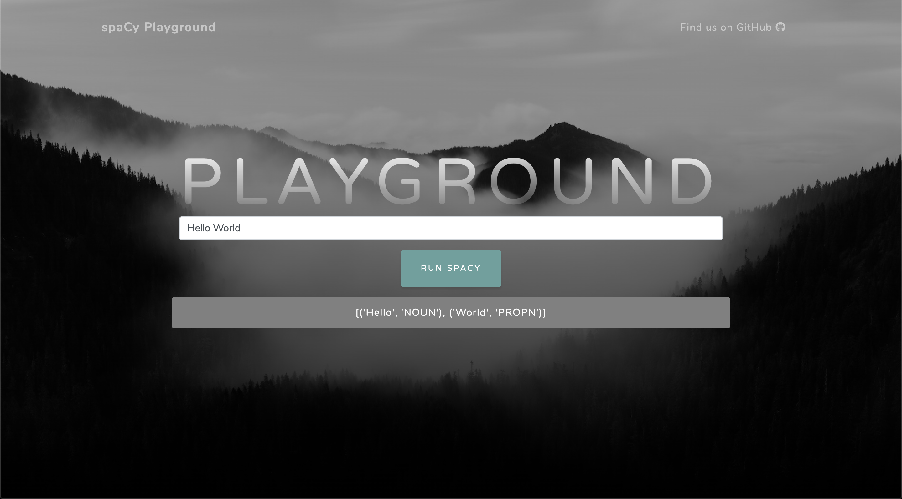

# spaCy Playground v1.0.0

## Preview



## SetUp

Download the project
```
git clone https://github.com/CoLoDot/spacyxflask.git
```

Activate virtual environnement
```
cd spacyxflask
python3 -m venv env
source env/bin/activate
```

Install dependencies 
```
pip install -r requirements.txt
python -m spacy download en_core_web_sm
```

Run unit tests
```
pytest
```

## Run spaCy Playground

Without hot reload
```
cd spacyxflask
flask run
```

With hot reload
```
cd spacyxflask
export FLASK_DEBUG=1
flask run
```

App will be available on ```http://127.0.0.1:5000```